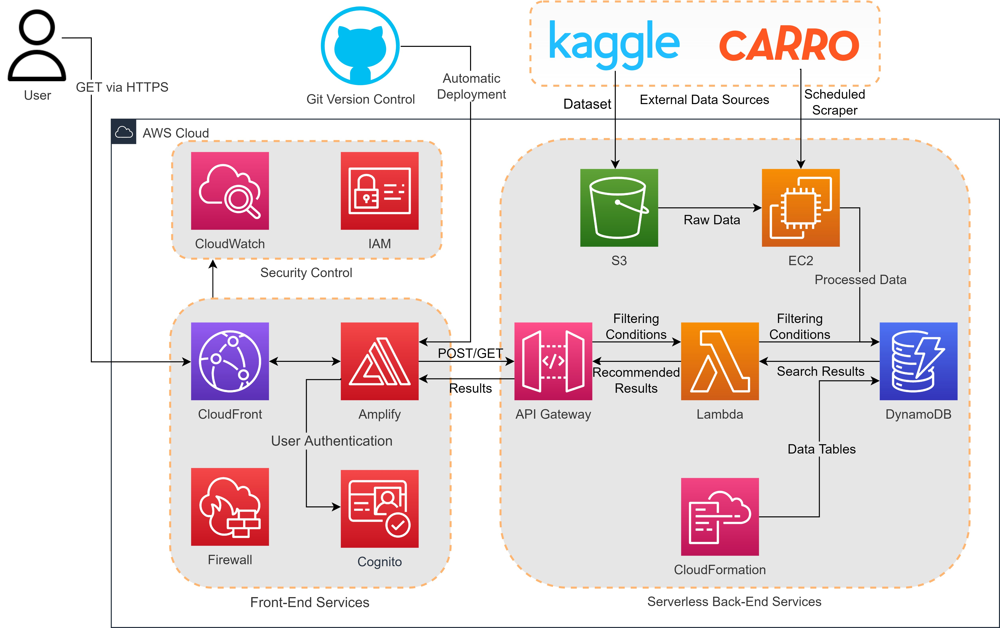

# CS5224-CarSpy
CS5224 Final Report: CarSpy - An Intelligent Recommendation Platform to find your Dream Used Car in Singapore

You can click [CarSpy Link](https://cs5224-carspy.auth.us-east-1.amazoncognito.com/login?response_type=code&client_id=7i41mg13jhsou7lrkdusc2kp9o&redirect_uri=https://main.d2vgm0hwfxxab2.amplifyapp.com/) to login our website.


## Introduction
This GitHub is for automatic deployment on Amplify.

Our architecture diagram: 




Our code files are:
```
CS5224-CarSpy/
|-- README.md

|-- assets/                 
|-- css/
|-- js/
|-- fonts/
|-- media/
|-- images/
|-- index.html
|-- listings.html
|-- listingDetail.html
|-- about.html              # frontend files

|-- lambda/                 # backend files
|-- img/                    # screenshots for our app
|-- data/                   # dataset files and recommendation
|-- cloudformation          # CloudFormation codes
```

## Dataset
We obtain used cars data from Kaggle's [100,000 Singapore Used Car Data set](https://www.kaggle.com/datasets/adityadesai13/used-car-dataset-ford-and-mercedes). It contains the scraped data of 100,000 used cars listings, which have been separated into files corresponding to each car manufacturer.

## Steps to Use Our SaaS
We already deployed our SaaS application on AWS cloud. You can follow these steps to view our app:
1. Go to https://cs5224-carspy.auth.us-east-1.amazoncognito.com/login?response_type=code&client_id=7i41mg13jhsou7lrkdusc2kp9o&redirect_uri=https://main.d2vgm0hwfxxab2.amplifyapp.com/
2. Sign up a new account and the verification code will be sent to your registered email.
3. Log in and you will be redirected to the main page of our app.
4. Start to search and enjoy our recommendations!

## Steps to Deploy Our SaaS
1. Set up a new AWS Amplify repository and link it to our GitHub where our project code stays: https://github.com/archiewang0716/CS5224-CarSpy.git
2. For each folder under lambda/ folder, set up a new AWS Lambda for it.
3. Configure a new API Gateway and define POST methods for newly created Lambda functions. CORS is needed to be enabled before deploying the API.
4. Build up user table with partition key **id** and car information table with partition key **uuid** in DynamoDB, and run the lambda function scipt(get_data) to load the car informantion from S3 to the DynamoDB.
5. Create a new user pool in Cognito service, on the navigation bar on the left-side of the page, choose App clients under General settings.
6. Choose Add an app client, and enter a name for your app client.
7. Select Cognito User Pool as one of the Enabled Identity Providers.
8. Unless you specifically want to exclude one, select the check boxes for all of the Allowed OAuth scopes.
9. On the Domain name page, type a domain prefix that's available (here we choose **cs5224-carspy**) and save all changes.
10. Configure the callback URL to the Amplify website url you have just created, and the sigp up page url is "https://your_domain/login?response_type=code&client_id=your_app_client_id&redirect_uri=your_callback_url".
Then you can follow the Steps to Use Our SaaS :')

## Contributor
- [Wang Changqin](https://github.com/archiewang0716)
- [Zhang Haolin](https://github.com/A0236053M)
- [Zhang Lei](https://github.com/AronnZzz)
- [Liu Haoyang](https://github.com/Ethan601)
